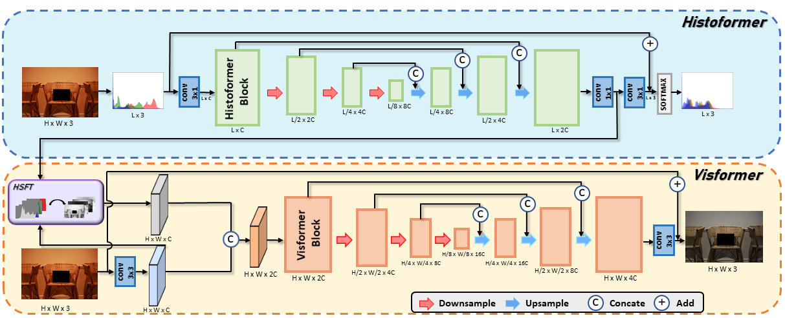
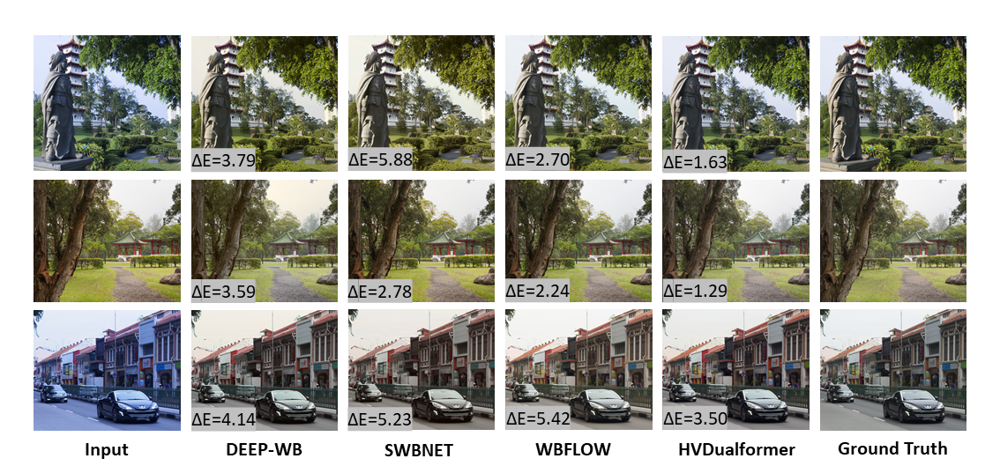
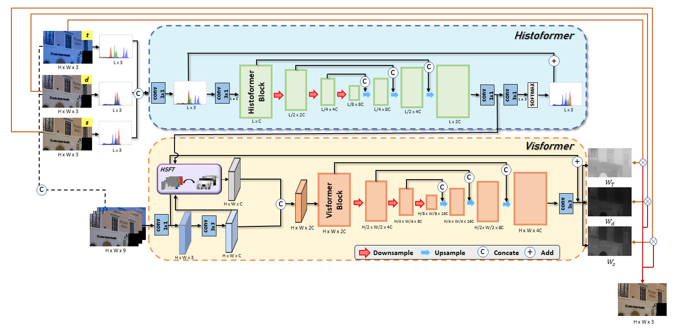

# HVDualformer: Histogram-Vision Dual Transformer for White Balance
Pytorch Implementation of HVDualformer: Histogram-Vision Dual Transformer for White Balance

## Abstract
Capturing images under different color temperatures can result in color casts, causing the presented color in photos to differ from what is perceived by the human eye. Correcting these color temperature shifts to achieve White Balance (WB) is a challenging task, requiring the identification of variations in color tones from diverse light sources and pinpointing a reference point to remove color casts. 
The advent of deep neural networks has significantly advanced the progress of white balance methods, evolving from simply identifying the scene illumination color to directly producing a color-corrected image from the color-shifted input. To better map color distributions and scene information from the input to the WB image, we propose HVDualformer, a histogram-vision dual transformer architecture that can rectify color temperature features from image color histograms and exploit them to correct image features. The proposed HVDualformer can handle both single-light source and multiple-light source scenarios.  Extensive experimental results on public benchmark datasets demonstrate that the proposed model performs favorably against state-of-the-art methods.

## Experiment

### Requirements
1. Python 3.8.15
2. pip install virtualenv
3. virtualenv awb
4. pip install torch==2.2.2 torchvision==0.17.2 torchaudio==2.2.2 --index-url https://download.pytorch.org/whl/cu121
5. pip install opencv-python
6. pip install timm
7. pip install scikit-image
8. pip install scikit-learn
9. pip install matplotlib
10. pip install einops
## Architecture of HVDualformer


## Training data
* The training fold is configured based on the methodology described in *[Deep White-balance Editing (CVPR 2020)](https://openaccess.thecvf.com/content_CVPR_2020/papers/Afifi_Deep_White-Balance_Editing_CVPR_2020_paper.pdf)*
* Training data is available from the *[Rendered WB dataset - Set1](https://cvil.eecs.yorku.ca/projects/public_html/sRGB_WB_correction/dataset.html)*
* To use HVDualformer+ (C=12), run the following command:
```
python train_d12.py --dir_img ../dataset/
```
* To use HVDualformer+ (C=8), run the following command:
```
python train_d8.py --dir_img ../dataset/
```
## Testing data
* Pretrained models : *[Rendered Cube+ dataset](http://gofile.me/65TdH/y7daONJB6)* 、 *[Rendered WB dataset:Set1-Test](http://gofile.me/65TdH/DkR69Z1JG)* 、 *[Rendered WB dataset:Set2](http://gofile.me/65TdH/YluetLLGD)*
* To use HVDualformer+ (C=12), run the following command:
```
python test_d12.py
```
* To use HVDualformer+ (C=8), run the following command:
```
python test_d8.py 
```
*  Change the `"get_test_set"` in test.py. <br>

## Results presentation


## HVDualformerW-Adapt to multiple-light sources


```
cd HVDualformerW
```
## Training data
* The training data is configured based on the methodology described in *[Auto White-Balance Correction for Mixed-Illuminant Scenes(WACV22)](https://arxiv.org/abs/2109.08750)*
* Training data is available from the *[Rendered WB dataset - Set1](https://cvil.eecs.yorku.ca/projects/public_html/sRGB_WB_correction/dataset.html)*
* Our pre-trained models are provided in *[model](http://gofile.me/65TdH/sj5T6YOKU)*
```
python traintds.py --patch-size <TRAINING PATCH SIZE>
python traintdsfc.py --patch-size <TRAINING PATCH SIZE>
```
## Testing data
* The testing data is configured based on the methodology described in *[Mixed-illumination dataset](https://arxiv.org/abs/2109.08750)*
```
python test.py --wb-settings <WB SETTING 1> <WB SETTING 2> ... <WB SETTING N>
```
